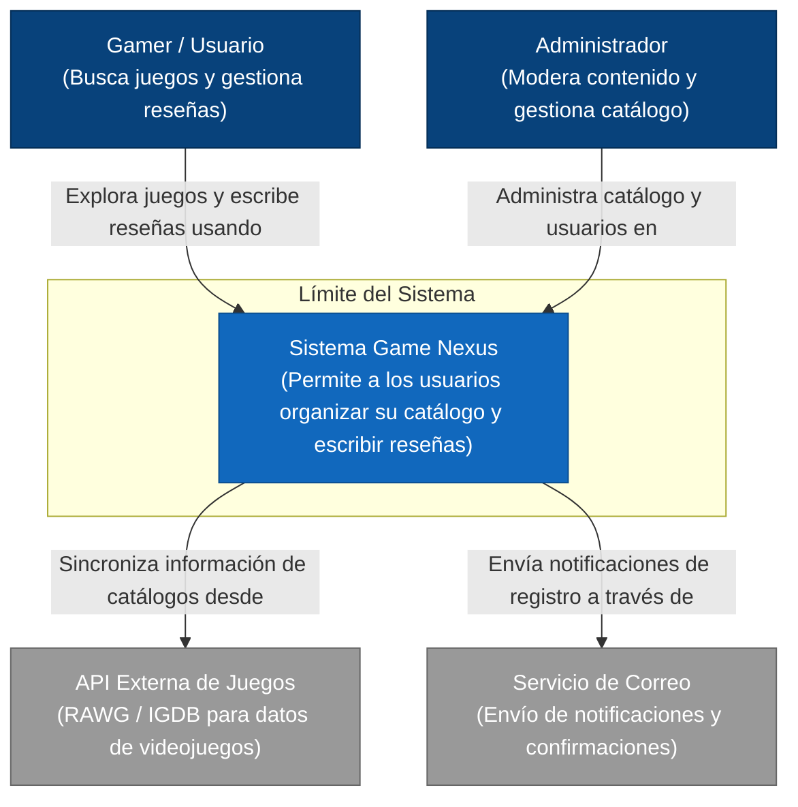
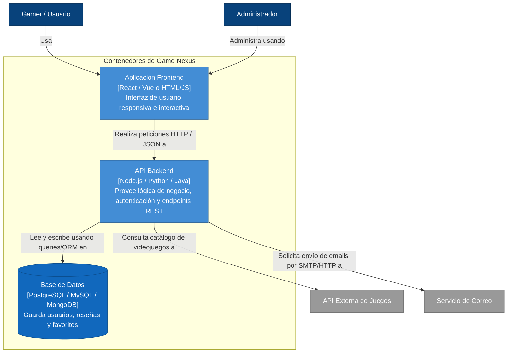
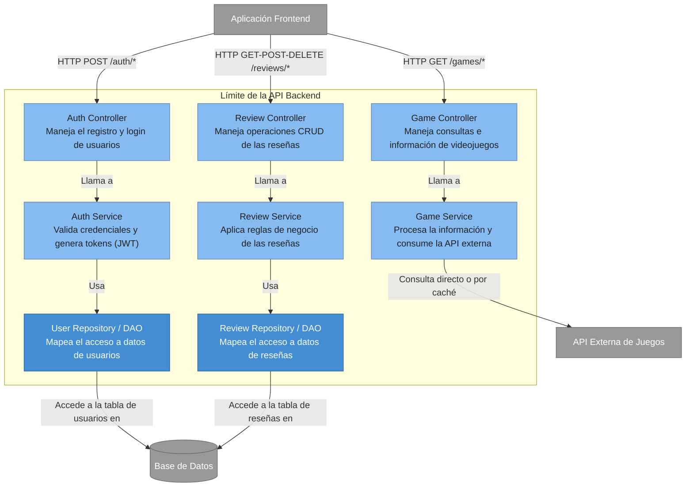

Nivel 1
###  ¿Para quién es?
* **Audiencia:** Miembros no técnicos del equipo, patrocinadores (stakeholders), clientes y nuevos desarrolladores que se incorporan al proyecto.

###  ¿Qué pregunta responde?
* **Pregunta:** ¿Cuál es el alcance del sistema Game Nexus, quiénes son sus usuarios y con qué sistemas externos interactúa?

Nivel 2 
## ¿Para quién es?
Audiencia: Desarrolladores, arquitectos de software y personal de operaciones (DevOps).
## ¿Qué pregunta responde?
Pregunta: ¿Cuáles son las aplicaciones o contenedores de datos que componen el sistema, qué tecnologías usan y cómo se comunican entre sí?

Nivel 3 — Componentes
## ¿Para quién es?
Audiencia: Desarrolladores de software y líderes técnicos encargados de codificar o dar mantenimiento a esta sección del sistema.
## ¿Qué pregunta responde?
Pregunta: ¿Cómo está estructurado internamente el contenedor principal (API Backend) y cuáles son las responsabilidades de sus componentes?

