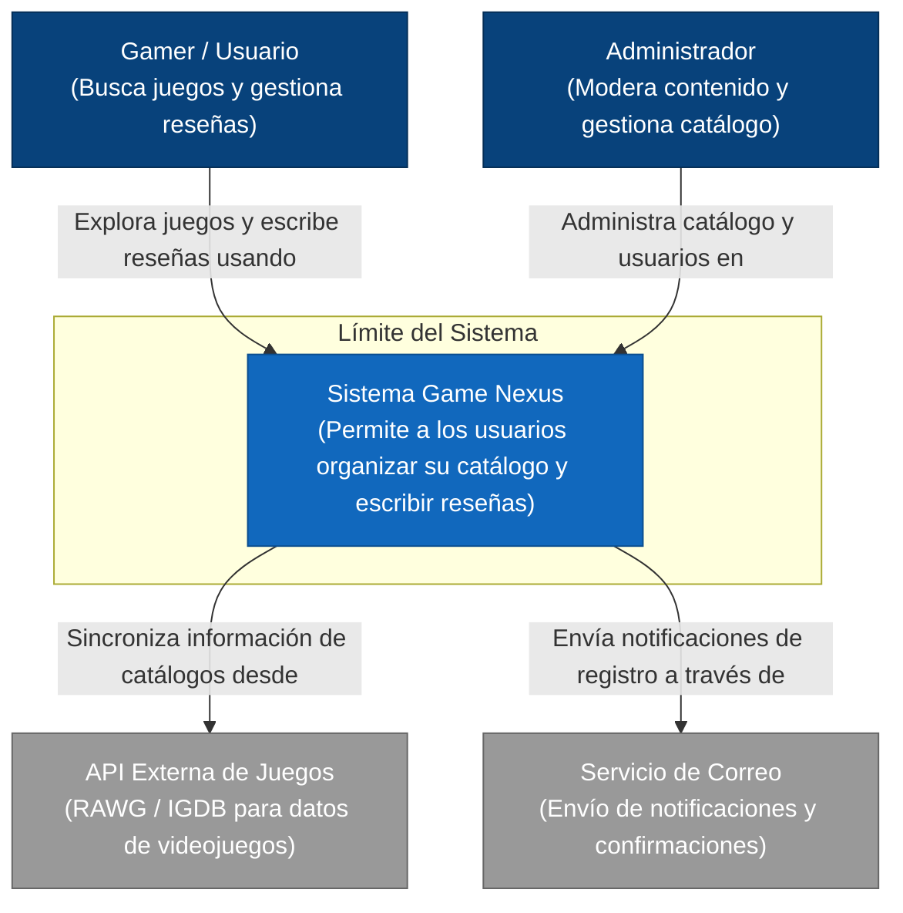

Nivel 1
###  ¿Para quién es?
* **Audiencia:** Miembros no técnicos del equipo, patrocinadores (stakeholders), clientes y nuevos desarrolladores que se incorporan al proyecto.

###  ¿Qué pregunta responde?
* **Pregunta:** ¿Cuál es el alcance del sistema Game Nexus, quiénes son sus usuarios y con qué sistemas externos interactúa?

